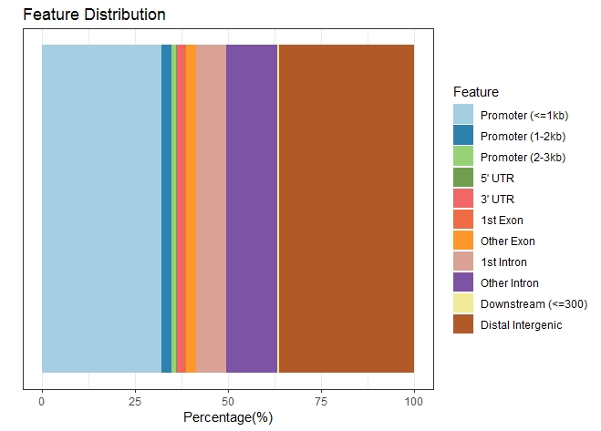
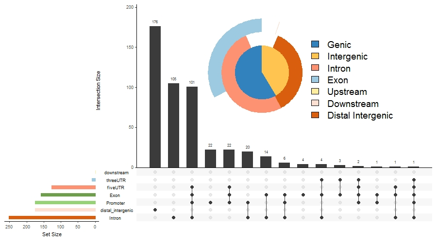

## 简介

ChIP是指染色质免疫沉淀，它通特异结合抗体将DNA结合蛋白免疫沉淀，可以用于捕获蛋白质（如转录因子，组蛋白修饰）的DNA靶点。

DNA和蛋白质交联(cross-linking)，超声(sonication)将染色体随机切割，利用抗原抗体的特异性识别(IP)，把目标蛋白相结合的DNA片段沉淀下来，反交联释放DNA片段，最后是测序(sequencing)。

motif是比较有特征的短序列。

## 实操

#### 所需数据

ChiP-seq分析练习所需数据已上传至[百度网盘](https://pan.baidu.com/s/170u_cHn6mVngajk-sFHzbw)， 提取码为sjey，欢迎下载。

#### 所需工具

* linux
	* bowtie
	* samtools
	* macs
* R语言
	* ChIPseeker
* 在线网站
	* http://meme-suite.org/tools/meme-chip

#### 比对

```
#建立索引，为了减少占用的计算资源
bowtie-build bowtie_index/mm10.fa bowtie_index/mm10
#查看生成的结果，共6个文件
ls -l bowtie_index/*.ebwt
#结果
-rw-r--r-- 1 y570pc y570pc 59026331 10月 25 19:57 bowtie_index/mm10.1.ebwt
-rw-r--r-- 1 y570pc y570pc 23988656 10月 25 19:57 bowtie_index/mm10.2.ebwt
-rw-r--r-- 1 y570pc y570pc      458 10月 25 19:55 bowtie_index/mm10.3.ebwt
-rw-r--r-- 1 y570pc y570pc 47977298 10月 25 19:55 bowtie_index/mm10.4.ebwt
-rw-r--r-- 1 y570pc y570pc 59026331 10月 25 19:59 bowtie_index/mm10.rev.1.ebwt
-rw-r--r-- 1 y570pc y570pc 23988656 10月 25 19:59 bowtie_index/mm10.rev.2.ebwt
#比对
bowtie -m 1 -S bowtie_index/mm10 Oct4.fastq > Oct4.sam  #'-S'表示输出格式为sam，'-m -1'表示reads多次map到参考序列时bowtie仅报道一次。
#查看结果
head -n 10 Oct4.sam
#部分结果
@HD	VN:1.0	SO:unsorted
@SQ	SN:chr1	LN:195471971
@PG	ID:Bowtie	VN:1.2.2	CL:"/usr/bin/bowtie-align-s --wrapper basic-0 -m 1 -S bowtie_index/mm10 Oct4.fastq"
SRR002012.45	0	chr1	125556548	255	26M	*	0	0GACAGTGATTCATTATGCTGGAATGT	IIIIIIIIIIIIBIIIIIIII7III$	XA:i:2	MD:Z:2A22A0	NM:i:2	XM:i:2
SRR002012.48	16	chr1	118910985	255	26M	*	0	0CCGCAAAGGCCGAAGGAGGCGCAATC	IIIIIII"III+IIFIIIIIIIIIII	XA:i:1	MD:Z:11T14	NM:i:1	XM:i:2
SRR002012.187	16	chr1	130368773	255	26M	*	0	0GACGGTCCATTACCCCAACTGCGTAC	I-I*I&IIIIIAIIIIIIIIIIIIII	XA:i:2	MD:Z:3T4C17	NM:i:2	XM:i:2
SRR002012.210	0	chr1	41092774	255	26M	*	0	0ATCTGCACAAAGCTTAGAGTGGATAA	I$III-IIIIIIIIIIIIIIII%III	XA:i:2	MD:Z:1G3A20	NM:i:2	XM:i:2
SRR002012.240	0	chr1	21217509	255	26M	*	0	0GCTCCAACTTTCCGACCCACAGAACA	IIIIIIIIIIII/IIII)III.II5I	XA:i:2	MD:Z:12A4A8	NM:i:2	XM:i:2
SRR002012.252	16	chr1	172408548	255	26M	*	0	0TGAGAGATAATATCTCATGGGGGGGT	F'IIIII=II+IIIIII;IIIIIIII	XA:i:1	MD:Z:1C24	NM:i:1	XM:i:2
SRR002012.348	0	chr1	176643081	255	26M	*	0	0GGCATGGGCTGACCACCTCGGGGTCT	II(IIIII(I?I%IIIII1%&-*9I/	XA:i:2	MD:Z:2A9A13	NM:i:2	XM:i:2
#转sam文件为bam文件，bam为二进制文件，可以减少存储空间
samtools view -bSo Oct4.bam Oct4.sam
#排序
samtools sort Oct4.bam -o Oct4.sorted.bam
#对已排序的文件建立索引
samtools index Oct4.sorted.bam  #h会生成索引文件Oct4.sorted.bam.bai
```

与Oct4.fastq文件处理类似，对gfp.fastq文件（对照组）也进行如上操作。

#### peak calling

```
macs14 -t Oct4.sorted.bam \
-c gfp.sorted.bam \
--format=BAM --name=Oct4 --gsize=138000000 \  #'--gsize'为比对的基因组大小
--tsize=26 --diag --wig  #'--tsize'指定read大小
```

## 下游分析

#### peak注释

```R
##安装依赖的包
options(repos="https://CRAN.R-project.org")
source("https://bioconductor.org/biocLite.R")
biocLite("TxDb.Mmusculus.UCSC.mm10.knownGene")
biocLite("ChIPseeker")
##设置工作路径
setwd("D://y570pc/yanshi")
##载入依赖的包
library("TxDb.Mmusculus.UCSC.mm10.knownGene")
library("ChIPseeker")
##载入数据
mm10<-TxDb.Mmusculus.UCSC.mm10.knownGene
macs<- readPeakFile("Oct4_peaks.bed")
##注释
anno <- annotatePeak(macs, TxDb=mm10)
##绘图
plotAnnoBar(anno)
upsetplot(anno, vennpie=TRUE)
##保存数据
anno_df<-as.data.frame(anno)
write.csv(anno_df,"anno.csv")
```

结果如下：





#### motif分析

因为接下来分析用到的网站只支持fa格式的文件，需要将bed文件转化为fa文件。

```
bedtools getfasta -fi ./bowtie_index/mm10.fa -bed Oct4_peaks.bed -fo Oct4_peaks.fa
```

[所需网站](http://meme-suite.org/tools/meme-chip)，按下图所示操作。


## 参考文献

[01]. [ChIPseeker: an R package for ChIP peak Annotation, Comparison and Visualization](http://bioconductor.org/packages/devel/bioc/vignettes/ChIPseeker/inst/doc/ChIPseeker.html)

[02]. [EBI: Next Generation Sequencing Practical Course](https://www.ebi.ac.uk/training/online/course/ebi-next-generation-sequencing-practical-course)

[03]. [学员分享-Chip-seq 实战分析流程](https://www.jianshu.com/p/c83a38915afc)

[04]. [ChIP Seq Alignment and Processing Pipeline](https://github.com/mahmoudibrahim/JAMM/wiki/ChIP-Seq-Alignment-and-Processing-Pipeline)

[05]. [NGS data analysis with R / Bioconductor: ChIP-Seq workflow](http://biocluster.ucr.edu/~rkaundal/workshops/R_feb2016/ChIPseq/ChIPseq.html#alignments)

[06]. [一篇文章学会ChIP-seq分析（上）](https://cloud.tencent.com/developer/article/1054954)

[07]. [第四章 ChIP-seq数据分析
Chapter 4: ChIP-seq data analysis](http://qiubio.com/new/book/chapter-05/?q=#csaw)