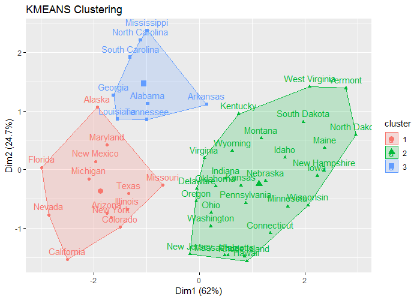
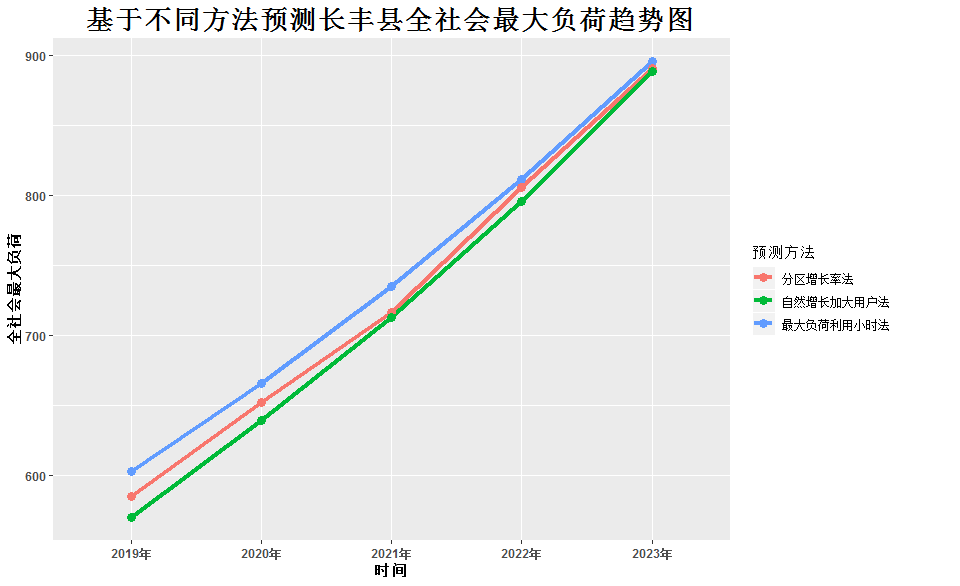

## 韦恩图（Venn diagram）

#### 基础

```R
library(VennDiagram)
venn.diagram(list(A=1:10,B=3:13,C=c(6:9,-3:0,15:18)), fill=c("red","green","blue"), alpha=c(0.5,0.5,0.5), cex=2, cat.fontface=4, fontfamily=3, filename="VennDiagram.tiff")
```

## 聚类图

```R
site="https:\\mirrors.tuna.tsinghua.edu.cn\CRAN"
package_list = c("factoextra","cluster")
for(p in package_list){
  if(!suppressWarnings(suppressMessages(require(p, character.only = TRUE, quietly = TRUE, warn.conflicts = FALSE)))){
    install.packages(p, repos=site)
    suppressWarnings(suppressMessages(library(p, character.only = TRUE, quietly = TRUE, warn.conflicts = FALSE)))
  }
}
data("USArrests")
USArrests = na.omit(USArrests)
desc_stats = data.frame( Min=apply(USArrests, 2, min),#minimum
                         Med=apply(USArrests, 2, median),#median
                         Mean=apply(USArrests, 2, mean),#mean
                         SD=apply(USArrests, 2, sd),#Standard deviation
                         Max=apply(USArrests, 2, max)#maximum
)
desc_stats = round(desc_stats, 1)#保留小数点后一位head(desc_stats)
df = scale(USArrests)  #对数据中心化和标准化
res = get_clust_tendency(df, 40, graph = TRUE)
res$hopkins_stat   #Hopkins统计量的值<0.5，表明数据是高度可聚合的
res$plot
set.seed(123)
## Compute the gap statistic
gap_stat = clusGap(df, FUN = kmeans, nstart = 25, K.max = 10, B = 500)  #估计聚合簇数
# Plot the result
fviz_gap_stat(gap_stat)
km.res = kmeans(df, 4, nstart = 25)
# Visualize clusters using factoextra
fviz_cluster(km.res, USArrests)
sil = silhouette(km.res$cluster, dist(df))  #提取聚类轮廓图
rownames(sil) = rownames(USArrests)
head(sil[, 1:3])
fviz_silhouette(sil)
neg_sil_index = which(sil[, "sil_width"] < 0)
sil[neg_sil_index, , drop = FALSE]
###eclust():增强的聚类分析
# Compute k-means
res.km = eclust(df, "kmeans")
# Gap statistic plot
fviz_gap_stat(res.km$gap_stat)
# Enhanced hierarchical clustering
res.hc = eclust(df, "hclust") # compute hclust
fviz_dend(res.hc, rect = TRUE) # dendrogam
fviz_silhouette(res.hc) # silhouette plot
fviz_cluster(res.hc) # scatter plot
```
结果


## 折线图

#### 基础

数据
```
时间,全社会最大负荷,预测方法
2019年,602.84,最大负荷利用小时法
2020年,665.53,最大负荷利用小时法
2021年,734.75,最大负荷利用小时法
2022年,811.16,最大负荷利用小时法
2023年,895.52,最大负荷利用小时法
2019年,585.09,分区增长率法
2020年,652.28,分区增长率法
2021年,716.32,分区增长率法
2022年,805.91,分区增长率法
2023年,890.27,分区增长率法
2019年,570.23,自然增长加大用户法
2020年,639.25,自然增长加大用户法
2021年,713.17,自然增长加大用户法
2022年,795.49,自然增长加大用户法
2023年,888.034,自然增长加大用户法
```
代码
```R
library(ggplot2)
df2<-read.csv("C:\\Users\\Administrator\\Desktop\\data01.csv",header=T,sep=",")
p<-ggplot(df2, aes(x=时间, y=全社会最大负荷, group=预测方法)) +
  geom_line(aes(color=预测方法),size=1.5)+
  geom_point(aes(color=预测方法),size=3)+
  ggtitle("基于不同方法预测长丰县全社会最大负荷趋势图")+
  theme(plot.title = element_text(hjust = 0.5,size=20,face="bold"),axis.title=element_text(face="bold"),
        axis.text=element_text(face="bold"))
p

#一元二次曲线拟合
line.model <- lm(df2$全社会用电量~df2$长丰县GDP+I(df2$长丰县GDP^2))
summary(line.model)
```
结果


数据

```
时间 回归分析法 时间序列法 弹性系数法
2019 24.85 25.84 25.85
2020 27.97 28.64 28.45
2021 31.5 31.64 31.32
2022 35.48 34.84 34.48
2023 39.98 38.24 37.95
2024 45.07 41.84 41.78
2025 50.82 45.64 45.99
```

代码

```python
import pandas as pd
import matplotlib.pyplot as plt 
from pylab import *  

mpl.rcParams['font.sans-serif'] = ['SimHei']  #解决matplotlib中文无法显示的问题

data = pd.read_csv('./Desktop/GDP.csv',header=0,encoding = 'ANSI')
data=data.set_index("时间")  #更改索引

plt.style.use('ggplot')
fig = plt.figure(figsize = (10,6))

data.plot(
    color = ['#C42022','#619DFF','#00BB35'] ,#折线图颜色
    marker = 'o',markersize = 4, #标记形状、大小设置
    )
     
plt.title('长丰县全社会用电量预测',color = '#6D6D6D',fontsize = 18)
plt.xlabel('时间')
plt.ylabel('全社会用电量')
plt.savefig('stock1.png',bbox_inches = 'tight',dpi = 300)
plt.legend() # 显示图例    
plt.show() 
```

多项式曲线拟合
```python
import pandas as pd
import matplotlib.pyplot as plt 
from pylab import * 
import seaborn as sns 
import numpy as np

mpl.rcParams['font.sans-serif'] = ['SimHei'] #解决matplotlib中文无法显示的问题
data = pd.read_csv('./Desktop/GDP.csv',header=0)


plt.style.use('ggplot')
fig = plt.figure(figsize = (10,6))

data.plot.scatter(x="时间",y="全社会用电量",
  color ='#C42022' ,#折线图颜色
  marker = 'o' #标记形状、大小设置
  )
#sns.lmplot(x="长丰县GDP",y="全社会用电量",data=data)
sns.regplot(data=data, x='时间', y='全社会用电量', order=2)
plt.text( 2.5,24,r'$y=8.82548+0.70291x+0.09986x^2$')   
plt.xlabel('时间')
plt.ylabel('全社会用电量')
plt.savefig('1.png',bbox_inches = 'tight',dpi = 300)
plt.legend() # 显示图例   
plt.show() 
```