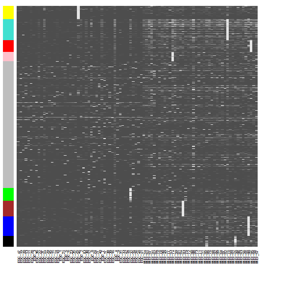
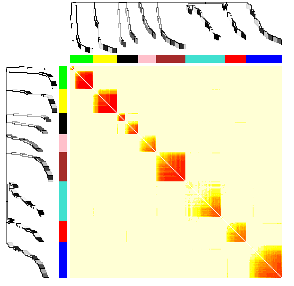

## 原理

**加权基因共表达网络分析**（WGCNA, Weighted correlation network analysis）是用来描述不同样品之间基因关联模式的系统生物学方法，可以用来鉴定高度协同变化的基因集。相比于只关注差异表达的基因，WGCNA利用数千或近万个变化最大的基因或全部基因的信息识别感兴趣的基因集，并与表型进行显著性关联分析。一是充分利用了信息，二是把数千个基因与表型的关联转换为数个基因集与表型的关联，免去了多重假设检验校正的问题。软阈值的筛选原则是使构建的网络更符合无标度网络特征。如果没有合适的**软阈值**（power），一般是由于部分样品与其它样品因为某种原因差别太大导致的，可根据具体问题移除部分样品或查看后面的经验值。在无向网络中，**模块**内是高度相关的基因。在有向网络中，模块内是高度正相关的基因。

**连接度*（Connectivity）：类似于网络中“度”（degree）的概念。每个基因的连接度是与其相连的基因的边属性之和。

Module eigengene：给定模型的第一主成分，代表整个模型的基因表达谱。

TOM（Topological overlap matrix）：把邻接矩阵转换为拓扑重叠矩阵，以降低噪音和假相关，获得的新距离矩阵，这个信息可拿来构建网络或绘制TOM图。 

## 实操

#### 数据

链接：https://share.weiyun.com/5ItPNi0 密码：k2q3fe

#### 代码

```R
library(WGCNA)
setwd("C:\\Users\\Administrator\\Desktop\\wgcna")
load("oed.RData")
dim(oed)
gene.names=rownames(oed)
trans.oed=t(oed)
n=500
datExpr=trans.oed[,1:n]
dim(datExpr)
SubGeneNames=gene.names[1:n]

### Choosing a soft-threshold to fit a scale-free topology to the network
powers = c(c(1:10), seq(from = 12, to=20, by=2))
sft=pickSoftThreshold(datExpr,dataIsExpr = TRUE,powerVector = powers,corFnc = cor,corOptions = list(use = 'p'),networkType = "unsigned")

sizeGrWindow(9, 5)
par(mfrow = c(1,2))
cex1 = 0.9;

# Scale-free topology fit index as a function of the soft-thresholding power
plot(sft$fitIndices[,1], -sign(sft$fitIndices[,3])*sft$fitIndices[,2],xlab="Soft Threshold (power)",ylab="Scale Free Topology Model Fit, signed R^2",type="n", main = paste("Scale independence"));
text(sft$fitIndices[,1], -sign(sft$fitIndices[,3])*sft$fitIndices[,2],labels=powers,cex=cex1,col="red");
abline(h=0.80,col="red")  # Red line corresponds to using an R^2 cut-off

# Mean connectivity as a function of the soft-thresholding power
plot(sft$fitIndices[,1], sft$fitIndices[,5],xlab="Soft Threshold (power)",ylab="Mean Connectivity", type="n",main = paste("Mean connectivity"))
text(sft$fitIndices[,1], sft$fitIndices[,5], labels=powers, cex=cex1,col="red")


### Generating adjacency and TOM similarity matrices based on the selected softpower
softPower = 7;

#calclute the adjacency matrix
adj= adjacency(datExpr,type = "unsigned", power = softPower)

#turn adjacency matrix into topological overlap to minimize the effects of noise and spurious associations
TOM=TOMsimilarityFromExpr(datExpr,networkType = "unsigned", TOMType = "unsigned", power = softPower);

colnames(TOM) =rownames(TOM) =SubGeneNames
dissTOM=1-TOM

#hierarchical clustering of the genes based on the TOM dissimilarity measure
geneTree = hclust(as.dist(dissTOM),method="average")

#plot the resulting clustering tree (dendrogram)
par(mfrow = c(1,1))
plot(geneTree, xlab="", sub="",cex=0.3)

# Set the minimum module size
minModuleSize = 20;

# Module identification using dynamic tree cut
dynamicMods = cutreeDynamic(dendro = geneTree,  method="tree", minClusterSize = minModuleSize);
#dynamicMods = cutreeDynamic(dendro = geneTree, distM = dissTOM, method="hybrid", deepSplit = 2, pamRespectsDendro = FALSE, minClusterSize = minModuleSize);
#the following command gives the module labels and the size of each module. Lable 0 is reserved for unassigned genes
table(dynamicMods)  #根据模块中基因数目的多少，降序排列,0(grey)表示未分入任何模块的基因。

# Plot the module assignment under the dendrogram; note: The grey color is reserved for unassigned genes
dynamicColors = labels2colors(dynamicMods)
table(dynamicColors)
plotDendroAndColors(geneTree, dynamicColors, "Dynamic Tree Cut", dendroLabels = FALSE, hang = 0.03, addGuide = TRUE, guideHang = 0.05, main = "Gene dendrogram and module colors")

#discard the unassigned genes, and focus on the rest
restGenes= (dynamicColors != "grey")
diss1=1-TOMsimilarityFromExpr(datExpr[,restGenes], power = softPower)

colnames(diss1) =rownames(diss1) =SubGeneNames[restGenes]
hier1=hclust(as.dist(diss1), method="average" )
plotDendroAndColors(hier1, dynamicColors[restGenes], "Dynamic Tree Cut", dendroLabels = FALSE, hang = 0.03, addGuide = TRUE, guideHang = 0.05, main = "Gene dendrogram and module colors")

#set the diagonal of the dissimilarity to NA 
diag(diss1) = NA;

#Visualize the Tom plot. Raise the dissimilarity matrix to the power of 4 to bring out the module structure
sizeGrWindow(7,7)
TOMplot(diss1, hier1, as.character(dynamicColors[restGenes]))

### Extract modules
module_colors= setdiff(unique(dynamicColors), "grey")
for (color in module_colors){
  module=SubGeneNames[which(dynamicColors==color)]
  write.table(module, paste("module_",color, ".txt",sep=""), sep="\t", row.names=FALSE, col.names=FALSE,quote=FALSE)
}

### expression patterns of these genes, as they're clustered
module.order <- unlist(tapply(1:ncol(datExpr),as.factor(dynamicColors),I))
m<-t(t(datExpr[,module.order])/apply(datExpr[,module.order],2,max))
heatmap(t(m),zlim=c(0,1),col=gray.colors(100),Rowv=NA,Colv=NA,labRow=NA,scale="none",RowSideColors=dynamicColors[module.order])

### Quantify module similarity by eigengene correlation
MEList = moduleEigengenes(datExpr, colors = dynamicColors)
MEs = MEList$eigengenes
plotEigengeneNetworks(MEs, "", marDendro = c(0,4,1,2), marHeatmap = c(3,4,1,2))
```

#### 部分结果展示





## 参考资料

[01]. [WGCNA分析，简单全面的最新教程](https://www.jianshu.com/p/e9cc3f43441d)

[02]. [WGCNA: Weighted gene co-expression network analysis](http://pklab.med.harvard.edu/scw2014/WGCNA.html)