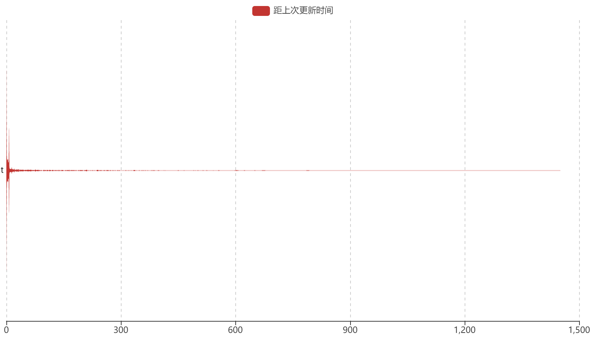
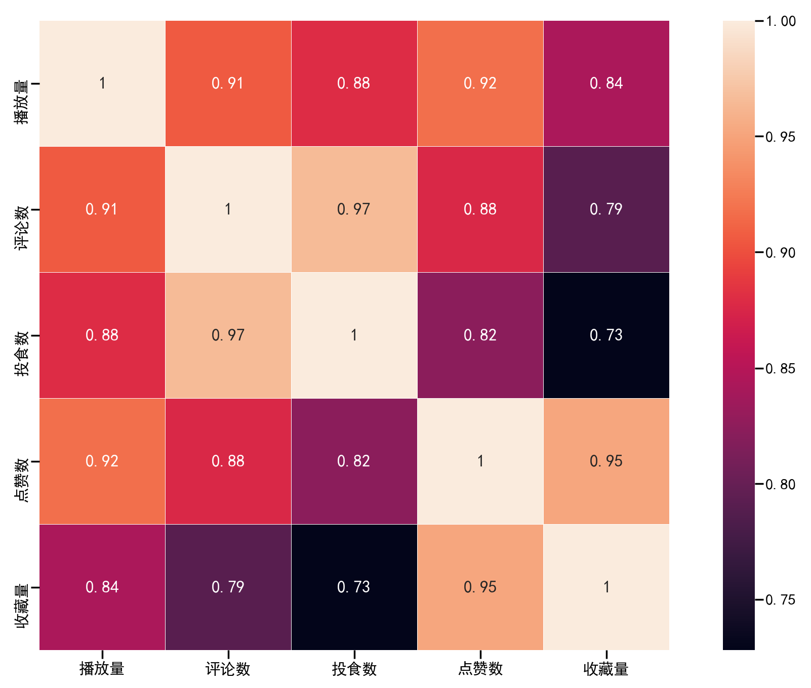

## 数据概况

​		数据采集于M站**广播剧板块，11月30日收集完全部声音id，共13498个声音。之后连续四天收集每个声音id对应的具体信息，因而对于动态数据（如播放量）不是在同一时间点采集到的。另外，因为网络访问延迟，可能存在部分应有的数据没有收集到。

​		采集到的数据包括：

- cv：cv_id、昵称、所在社团id
- up主：up_id、up主昵称、粉丝数、上传作品数
- 广播剧信息：声音id、声音名、剧id、剧名、作者、改编作品、制作组信息、配音组信息、音乐组信息、上传时间、tags
- 广播剧数据：播放量、评论数、投食数、点赞数、下载量（也可能是拍砖数，尚无法确定，故没有纳入统计）、收藏量
- 打赏信息：user_id、用户昵称、打赏数

## 数据分析

​		M站第一部**广播剧发表于2014年9月15日，此后两年上传的声音数量高速增长，之后基本维持稳定，推测2016年后核心创作人员形成垄断局面。2017年，播放量呈现爆发式增长，可能与平台作品数量增长遇到瓶颈，急需扩大受众群体的策略有关，b站为M站最大股东（持股比例为66.37%），推测可能与b站引流有关。

​		在41527个标签中，有5800类标签，统计不同标签出现的次数，从多到少排序后，取前200个画词云图。

​		人工挑选top10的类型标签，分别是现代（1153）、古风（884）、HE（187）、欢脱（170）、搞笑（158）、校园（153）、民国（138）、虐（130）、甜（120）、悬疑（107）。

​                                                                    **按年统计不同类型广播剧数量**

|      | 2015 | 2016 | 2017 | 2018 | 2019 |
| ---- | ---- | ---- | ---- | ---- | ---- |
| 现代 | 172  | 246  | 331  | 380  | 335  |
| 古风 | 105  | 257  | 219  | 303  | 246  |
| HE   | 18   | 19   | 32   | 44   | 79   |
| 欢脱 | 83   | 12   | 22   | 45   | 36   |
| 搞笑 | 7    | 11   | 26   | 32   | 88   |
| 校园 | 11   | 20   | 40   | 52   | 52   |
| 民国 | 13   | 18   | 30   | 37   | 53   |
| 虐   | 30   | 40   | 39   | 102  | 94   |
| 甜   | 4    | 9    | 37   | 76   | 146  |
| 悬疑 | 4    | 2    | 16   | 15   | 93   |

[^]: （2014年数据与2015年数据合并，因为按关键字匹配标签，所以统计的类型数据可能会大于标签数据）

​		从图中可以看出，总体而言，广播剧的多样性在逐年提高，现代和古风占比逐年降低，其他类型占比逐年升高，其中，“HE”、“甜”、“悬念”增长较快，符合当下年轻人的审美趋势。

​		共用8970部广播剧，以全一集为主，全一集的广播剧有7345部，最长的可达45集。不同集数分布情况如下。

### 

​		在4528对相邻剧集（同一部剧相邻发布时间称为一对）中，更新相隔时长主要集中在0-7天，占比达67%。其中最长更新时长为1451天，真的是等的黄花菜都凉了。更新速度分布如下图：

### 

​		若声音id有对应剧id，则找到剧id对应的所有声音id；否则，给声音id分配一个剧id，剧id命名方式为0+声音id，以确保剧id无重复。统计每部剧声音平均数据（包括播放量、评论数、投食数、点赞数、拍砖数、收藏量）。分别对其做归一化处理，，五分作为满分，对每部剧打分。排名前十的广播剧如下表：

|                | 播放量   | 评论数   | 投食数   | 点赞数   | 收藏量   | 总分     |
| -------------- | -------- | -------- | -------- | -------- | -------- | -------- |
| 魔道祖师       | 1        | 0.984674 | 0.866077 | 1        | 1        | 4.850751 |
| 魔道祖师第三季 | 0.544994 | 1        | 1        | 0.488006 | 0.535304 | 3.568304 |
| 魔道祖师第二季 | 0.546879 | 0.814539 | 0.905447 | 0.468315 | 0.564767 | 3.299948 |
| 不谈恋爱就去死 | 0.307377 | 0.331989 | 0.304878 | 0.480901 | 0.640105 | 2.065251 |
| 影帝           | 0.288816 | 0.4629   | 0.505615 | 0.306602 | 0.37958  | 1.943513 |
| 默读第一季     | 0.337544 | 0.308366 | 0.469896 | 0.30322  | 0.306223 | 1.725249 |
| 总裁不苏       | 0.17417  | 0.212656 | 0.130714 | 0.344509 | 0.516999 | 1.379049 |
| 伪装学渣广播剧 | 0.21272  | 0.277918 | 0.285089 | 0.258574 | 0.270064 | 1.304364 |
| 撒野第一季     | 0.281325 | 0.248331 | 0.189574 | 0.298334 | 0.263517 | 1.281081 |
| 撒野第三季     | 0.147032 | 0.400827 | 0.321139 | 0.196877 | 0.201965 | 1.267839 |

​		从上表可以明显看出，《魔道祖师》以无可争议的数据排名第一，远远拉开与其他剧的距离，在排名前十的剧中季播剧较多，唯一上榜的全一集剧是《总裁不苏》。将上表数据可视化为雷达图如下：

​		五个指标的相关性如下：

​		在约42812个职位中，统计出现次数排名前40的制作人员类型，并统计每种类型职位出现次数排名前5的人员（舍弃2个及以下英文字母的人员），结果如下表。可见广播剧制作是一个分工特别明确的工作。

| 后期     | 魔渔队             | 新桐         | 桃子          | 花世               | 龙队长     |
| -------- | ------------------ | ------------ | ------------- | ------------------ | ---------- |
| 编剧     | 洲洲               | 六音         | 马小瞳        | 树枝               | 玲珑骰     |
| 策划     | 古月丽莎           | 鲨鱼         | 青什          | 奶瓶儿             | 槑槑殿下   |
| 美工     | Akumas             | Alicia       | AnnoiB        | Aris               | Aslan      |
| 导演     | AMO                | Acy姜殊      | Alexa         | Amuro              | Auto       |
| 宣传     | AJAX               | ALIEN        | Aka荳比十万娘 | Anser              | Bonheur喵  |
| 原著     | PEPA               | 白云诗       | 风弄          | 非天夜翔           | 公子欢喜   |
|          | 墨香铜臭           | priest       | 娇羞胡萝卜    | 困倚危楼           | 楚云暮     |
| 报幕     | AKI                | AMURO        | Adsv          | Aly                | Amuro      |
| 填词     | Adagio凉叙         | Aris         | Aslan         | Aslan的狮妹        | Cynya      |
| 原曲     | AGA                | ANewHope     | Ailee         | Aimer              | Ali        |
| 翻唱     | AGGreen            | AYQ          | Aaron         | Aki                | Alan威     |
| 监制     | Always监制组       | Ann季流火    | Cannnnndy     | Ccccr凌儿          | Cosine     |
| 演唱     | AimeeBlackschleger | Amuro        | Ash           | CLOUD              | CZT        |
| 海报     | Agota              | Akuya        | Angeline      | Aslan              | BREEZE果   |
| 旁白     | ADSV               | Asdv         | E只猫         | FORSAKEN           | balon      |
| ED       | AHundredTimes      | Joanna       | Paradise      | STYLE              | Schlaglos  |
| 策导     | Acy姜殊            | KOKO殿       | MOCO          | P口巾              | S酱        |
| 混音     | CReiFu             | CZT          | CuTTleFiSh    | Eric               | Eric周     |
| 歌后     | Aggi南衣           | CCCCr凌儿    | CReiFu        | Ccccr凌儿          | Chancy     |
| 题字     | Akumas             | Bucky        | Finnn         | Joelasolitude      | fafa       |
| 手绘     | Akiko              | Akumas       | Akumas笃清    | Alavender          | BREEZE果   |
| 画师     | Alavender          | Alnic        | Attack        | ENOFNO             | E耀冬      |
| 原唱     | Aimini             | Aki阿杰      | AlexClare     | AlvaroSoler        | CAllStar   |
| 作词     | Cyril程            | HoneyWoriks  | Hush          | Just               | Vagary     |
| 制片     | 牧阿迟             | 猫耳         | 猫耳FM        | 白露               | 纤秾       |
| PS       | Aslan              | BOMLIM       | Esperanza     | M先生              | TEN        |
| PS美工   | AnnoiB             | Bosnia       | KEY           | Lncia              | M先生      |
| 剧务     | Ccccr凌儿          | Monkey       | TEVANS        | Tifa               | candy糖糖  |
| 出品     | DEG攻作室          | DEG攻作组    | G调弦音       | M站                | Rela热拉   |
| 作曲     | HirooYamaguchi     | Hiroyuki     | HoneyWoriks   | Jonnic             | Just       |
| 海报画师 | Higga              | SpoonKid     | papasan       | 三原               | 三口       |
| 板绘     | AllySion           | Asa          | Dustin        | EDI                | JETZT      |
| 原作     | Apple              | KcielJ       | Kirakira九    | LO是说了一半的LOVE | MinorNight |
| 制作     | Anya               | StudioASC    | Tianna小煎饼  | 一水               | 一颗土豆   |
| 策编     | Ccccr凌儿          | JAE          | MOMO          | keisuke            | 三三       |
| 编曲     | CZ蓝               | DH音乐工作室 | Hermes        | HoneyWoriks        | LBG        |
| 协助     | AMO                | Aslan        | Mixtan        | SK卷卷猫           | 三蛇肥     |
| 剧后     | CReiFu             | Chancy       | Egoistic      | Minnie             | Tick       |
| 原创配乐 | Enderdz            | Shay         | 向荣          | 奥麦斯             | 宏宇       |
| 录音     | Wenenn             | 丁其敏       | 丁翔威        | 习习               | 亚麻       |

[^]: 可能因为切词规则单一，会有部分人名出差，需要进一步核实

​		共有13498个声音、1973个cv、141个社团，将数据导入neo4j数据库，选取其中的若干个画cv和声音之间的关系图谱。

​		统计参与声音最多的top10 cv、好评率最高的top10 cv、旗下cv最多的top10社团、艺人口碑率最高的top10社团，好评率以归一化的声音录制数乘以归一化的平均声音好评率再归一化得到最终的好评率（避免好评率高但作品少扭曲了数据），口碑率计算方法类似。由表可以看出，cv作品量与好评率无太大关系，社团艺人数与口碑数关系较为密切。

| 参与声音最多的cv | 好评率最高的cv | 旗下cv最多的社团     | 艺人口碑率最高的社团 |
| ---------------- | -------------- | -------------------- | -------------------- |
| 郁望梦始         | 路知行         | 翼之声中文配音社团   | 翼之声中文配音社团   |
| 薄荷君           | 图特哈蒙       | 剪刀剧团             | 北斗企鹅             |
| 桂圆翊宝         | 魏超           | 水岸聆音广播剧团     | 729声工场            |
| 李逍遥           | 张恩泽         | 决意同人中文配音社团 | 光合积木             |
| 冬冬             | 李轻扬         | C.SH工作室           | 音熊联萌声优工作室   |
| 斑马             | 三途彼岸       | 木人巷工作室         | 剪刀剧团             |
| 星潮             | 钱文青         | 729声工场            | 与声俱来配音社团     |
| 羊仔             | 姜广涛         | KA.U中文配音社团     | C.SH工作室           |
| 饕餮             | 羊仔           | 光合积木             | 水岸聆音广播剧团     |
| 墨千临           | 李兰陵         | 音熊联萌声优工作室   | 木人巷工作室         |

**致歉：因时间仓促，有些地方处理的不够严谨，敬请谅解。**

**下一步**

- *分析twitter数据，挖掘贵圈名媛*
- *分析LBS社交软件用户相关信息*

 **声明：本文为y570pc原创，未经授权不得转载。** 

